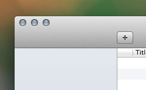

##JWToolbarAdaptiveSpaceItem

###Description
`JWToolbarAdaptiveSpaceItem` is an `NSToolbarItem` subclass that acts as an adaptive spacer for OS X applications with a toolbar and source list or other pane-like structure. Once set up, it will automatically adjust its width to match the width of an attached `NSView` (most likely the left pane of an `NSSplitView`) as can be seen in applications like Apple Mail.

###Usage
1. Add `JWToolbarAdaptiveSpaceItem` .h/.m to your Xcode project
2. Add a blank `NSToolbarItem` to your window's toolbar
3. With the blank toolbar item selected, select the Identity inspector and change the item's class to `JWToolbarAdaptiveSpaceItem`
4. Connect the `linkedView` outlet of the spacer item to the appropriate `NSSplitView` subview or other relevant `NSView`
5. That's it! You now have a spacer item that resizes itself through the incredible powers of KVO.

###Recommendations
Toolbar customization is best turned off when using `JWToolbarAdaptiveSpaceItem` because otherwise, the user may place the adaptive toolbar item in locations other than the intended position, causing strange things to occur. Future revisions may address this issue.
